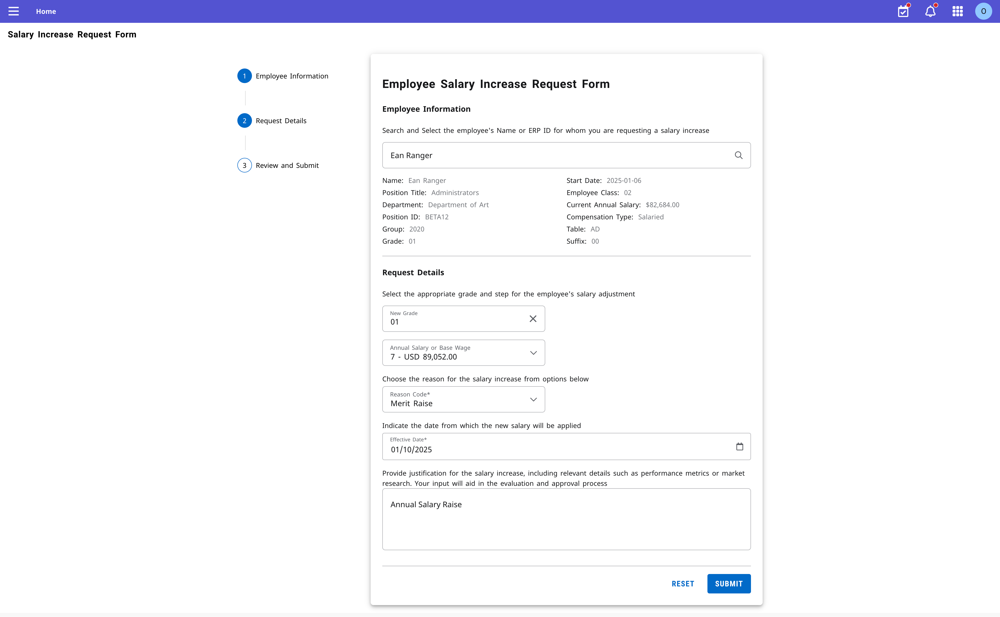
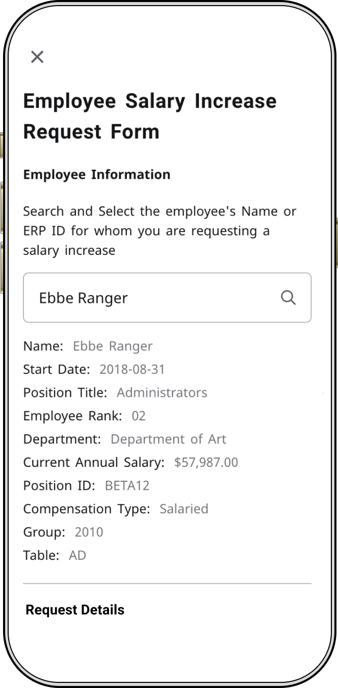

# Experience HR Salary Increase Request - Ellucian Intelligent Processes(EIP) Workflow

This extension facilitates a streamlined process for HR members known as **Originators** to formally request the employee's salary increase through group approval process. 

It comprises code for a Experience Card and Page along with an associated EIP workflow designed to facilitate salary increase changes by Originators.

The Experience Card and Page enables Originators to specify the target employee and their desired salary packages, triggering the invocation of the EIP workflow.

The EIP workflow, in turn, executes the salary increase process using the information provided by the Originators through the Experience Page.

## HR Salary Increase Request - Experience Card

The experience card features a straightforward hyperlink leading to the Salary Increase Request Form.

<p align="center">
    
</p>

## HR Salary Increase Request - Experience Page

The Salary Increase Request Form presents a comprehensive array of fields which Originators are required to full in order to retrieve pertinent employee information for initiating a salary increase change request.

<p align="center" >
    
</p>

Upon choosing the target employee, their basic information like Name, Position Title, Current Annual Salary, Compensation Type etc are displayed under the employee field like shown below

<p align="center" >
    
</p>

Once the employee information is prepared, we can begin by selecting the appropriate grade for the employee's salary and its corresponding salary package. Next, we must choose the reason for the salary change and specify the effective date for the new salary package to take effect. Finally, a justification field is provided where the rationale for the salary increase request must be entered.

<p align="center" >
    
</p>

Once the form is submitted, we'll be invoking the Ellucian Intelligent Processes Workflow.

### JSON Body

The following JSON body is what we'll be submitting to EIP Workflow API ie, workflow-instances API. We have to configure the below mentioned API parameters under the variables key on EIP Start section.

Please refer the Start Parameters image under the EIP Workflow section.

```json
{
    "id": "a808968d-5245-4249-8563-a1700157ffa6",
    "requestedFor": "13f2b1de-94d6-4651-99d5-4fc48dbfb21a",
    "variables": {
        "requestDate": {
            "value": "2024-07-08"
        },
        "requestedBy": {
            "value": "Dorothy Anne"
        },
        "employeeName": {
            "value": "Ebbe Ranger"
        },
        "personId": {
            "value": "13f2b1de-94d6-4651-99d5-4fc48dbfb21a"
        },
        "justification": {
            "value": "Ebbe has been on this pay scale for more than a year. It's time for pay increase"
        },
        "effectiveDate": {
            "value": "2024-07-31"
        },
        "step": {
            "value": "4"
        },
        "compensationType": {
            "value": "Salaried"
        },
        "currency": {
            "value": "USD"
        },
        "proposedSalary": {
            "value": "63672"
        },
        "currentSalary": {
            "value": "57987"
        },
        "departmentId": {
            "value": "1dc3bbd3-d80f-43b1-95c4-86f939bcf257"
        },
        "employeePositionTitle": {
            "value": "Administrators"
        },
        "employerId": {
            "value": "21830ce9-e350-4f8b-b1e3-cc862ebd81e4"
        },
        "positionCode": {
            "value": "BETA12"
        },
        "positionId": {
            "value": "bedc3b6b-fd4f-4e34-a114-382649f68b64"
        },
        "suffix": {
            "value": "00"
        },
        "erpId": {
            "value": "RANGEMPL1"
        },
        "grade": {
            "value": "01"
        },
        "reasonCode": {
            "value": "Merit Raise"
        }
    }
}
```

## Ellucian Intelligent Processes

<p align="center" >
    
</p>

#### Start Parameters

Under the start section, we have configure all the above mentioned API variables under start parameters as follows.

<p align="center" >
    
</p>

### APIs

This extension necessitated the utilization of both EEDM, BP APIs and couple of Spec APIs along with custom DataConnect Serverless APIs. The following is a compilation of the APIs employed in this context

| Endpoint                              | API Type        |   
| ------------------------------------- | ----------------|
| [job-change-reasons](https://resources.elluciancloud.com/bundle/banner_api_ethos_api_job_change_reasons_7.0.0/page/job-change-reasons.html)                    |  EEDM           |
| [persons](https://resources.elluciancloud.com/bundle/banner_api_ethos_api_persons_12.6.0/page/persons.html)                               |  EEDM           |
| [institution-jobs](https://resources.elluciancloud.com/bundle/banner_api_ethos_api_institution_jobs_12.2.0/page/institution-jobs.html)                      |  EEDM           |
| [institution-positions](https://resources.elluciancloud.com/bundle/banner_api_ethos_api_institution_positions_12.0.0/page/institution-positions.html)                 |  EEDM           |
| [employment-departments](https://resources.elluciancloud.com/bundle/banner_api_ethos_api_employment_departments_12.1.0/page/employment-departments.html)                |  EEDM           |
| [employee-job-assignments](https://resources.elluciancloud.com/bundle/banner_api_erp_api_employee_job_assignments_1.0.0/page/employee-job-assignments.html)              |  Banner ERP API |
| [employee-job-details](https://resources.elluciancloud.com/bundle/banner_api_erp_api_employee_job_details_1.0.0/page/employee-job-details.html)              |  Banner ERP API |

- [workflow-instances (Maestro Workflow API)](https://resources.elluciancloud.com/bundle/services_maestro_api_api_workflow_instances_1.0.0/page/workflow-instances.html)
  

### DataConnect Serverless APIs & Authorization

It is imperative to generate Dataconnect Serverless APIs for all specified APIs, excluding the `workflow-instances`. Specifically, the `save-salary-increase-request` API will utilize the `Ethos Token` Authentication type, while all other APIs will employ the `User Token` authentication method.

Kindly check the below documentation links for creating Serverless APIs and setting up authorizations permissions for the above mentioned authentication methods
- [DataConnect Serverless APIs](https://resources.elluciancloud.com/bundle/ethos_data_connect_int_design_acn_use/page/t_dc_designer_create_serverless_api.html)
- [Ethos Token](https://resources.elluciancloud.com/bundle/ethos_data_connect_int_design_acn_use/page/t_dc_designer_ethos_token_configuration.html)
- [User Token](https://resources.elluciancloud.com/bundle/ethos_data_connect_int_design_acn_use/page/t_dc_designer_user_token_configuration.html)

For the documentation on `workflow-instances`, kindly refer [here](https://resources.elluciancloud.com/bundle/services_maestro_api_api_workflow_instances_1.0.0/page/workflow-instances.html).

| Endpoint|   Token Type | Description   |
| --------| ---------|--------------------- |
| [get-job-change-reasons-hr-salary-increase-request](../data-connect/get-job-change-reasons-hr-salary-increase-request.json) | User Token | |
| [get-persons-hr-salary-increase-request](../data-connect/get-persons-hr-salary-increase-request.json) | User Token | |
| [get-persons-info-hr-salary-increase-request](../data-connect/get-persons-info-hr-salary-increase-request.json) | User Token | |
| [save-salary-increase-request](../data-connect/save-salary-increase-request.json) | **Ethos Token** | This API updates the employee salary by calling `employee-job-details` API and captures the justification comment |

## Path Design System

For this extension, we have leveraged the following Path Design components to create a clean and minimal UI.

- Card
- Grid
- TextField
- Search
- Button
- Divider
- Dropdown
- Snackbar
- Skeleton
- DropdownItem
- SearchItem
- Typography
- DatePicker
- CircularProgress
- makeStyles

With Path Design System, you get to experience unparalleled cross-device compatibility, as this extension effortlessly adapts and shines with responsive design.

## Technologies

#### Dataconnect Serverless APIs

As the HR Salary Increase Request experience is exclusively accessible to users with the Originators role, direct utilization of authenticatedEthosFetch is not feasible, given that the majority of APIs are restricted to the experience-admin role. Consequently, we have developed all aforementioned APIs on Data Connect as serverless APIs, with the exception of the `workflow-instances` API.

## Grids

With the Path Design system's grids, our UI seamlessly adapts to whichever screen the user is viewing and provides a flawless user experience.

<p align="center">
    
</p>
<p align="center">
    
</p>


Copyright 2024 Ellucian Company L.P. and its affiliates.